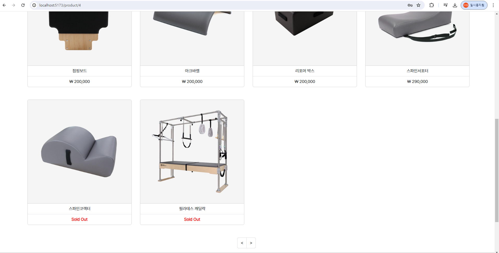

<p align="middle" >
  
</p>
<h1 align="middle">SSATANDARD</h1>
<h3 align="middle">운동용품 쇼핑 홈페이지 구현 및 재고관리</h3>

<br/>

## 📝 프로젝트 소개

사회인들에게 운동은 더 이상 선택이 아닌 필수가 되어가고 있습니다.
하지만 운동을 하기 위한 물품을 구매하는 것은 고금리 사회에서 소비 부담이 될 수 있기 때문에,  
저희는 유통 과정에서의 마진을 줄여 운동의 표준 이상의 품질과 저렴한 가격을 선보이고자 합니다.

<br/>

## 🌁 프로젝트 배경

SSATANDARD REST API는 운동용품을 판매하는 쇼핑몰 프로젝트로, 사용자 관리, 제품 관리, 장바구니 및 주문 관리 기능을 제공합니다.
이 프로젝트는 고객이 웹사이트를 통해 쉽게 제품을 검색하고 구매할 수 있도록 돕기 위해 설계되었습니다.

프로젝트를 시작하고 기본 CRUD를 구현하는 상황에서, 단순 CRUD 기능의 반복은 나의 성장에 도움을 줄 수 있었고, 더 복잡한 처리를 해보고자 했습니다.
쇼핑몰은 수요와 공급이 존재하는 만큼 한정된 재고 안에서 상품과 재화의 교환이 발생하기 때문에 '재고' 라는 키워드 중심으로 판매자와 소비자가 상호 작용하게 됩니다.

따라서 나의 성장을 위한 이해를 발전시키고, 기본 기능마저도 포기하지 않는 프로젝트로 쇼핑몰을 선택했습니다.

<br>


<br/>

## ⭐ 주요 기능
  - 장바구니 구현 기능
  - 가상의 주문 구현 기능
  - 재고 등록 및 관리 기능
  - 상품 등록 기능
  - 관리자 전용 페이지 구현 기능

- **회원가입**
  - 회원가입 시 이미 존재하는 ID를 입력하는 경우
    - 해결: 정규 표현식을 사용하여 프론트엔드에서 입력값 검증 및 백엔드에서 중복 체크
    - 상세 설명: 프론트엔드에서는 JavaScript 정규 표현식을 사용하여 사용자가 입력한 ID의 유효성을 검증하고, 백엔드에서는 데이터베이스 조회를 통해 중복된 ID가 있는지 확인합니다.\
  - 다음 주소 API 사용
  

- **로그인** : 정규 표현식을 사용하여 프론트엔드에서 입력값 검증 및 백엔드에서 중복 체크
  - session을 통한 로그인 정보 관리
    - BACK: session
    - FRONT: sessionStorage
  
  
  

- **로그아웃** : session 및 sessionStorage에 저장한 Key : Value 제거
  

- **메인 페이지** : 신상품, 인기상품, 광고판
  

- **카테고리별 상품 조회** : 정렬조건 기능 구현
  
  

- **검색을 통한 상품 조회** : input값을 상품명에 포함하는 모든 상품 조회
  

- **상품 구매 페이지** : 즉시구매, 장바구니 담기 기능 구현
  - 수량 선택 시, 남은 재고 이상 선택 불가
    

  - 품절 시, 제품 구매 및 장바구니 불가
    
    

  - 비동기 처리
    - 즉시 구매 시, 즉각 재고 반영
      

  - 이미 담겨 있는 상품의 경우, 수량 변경 기능 구현
    
    

- **장바구니 페이지** : 장바구니 개별 삭제, 장바구니 전체 삭제, 100,000원 이상 결제 시 배송비 무료 처리 기능 구현
  
  

  - 장바구니 구매 시, 일부 상품 결제 불가(선택 수량 > 상품 재고) 시 결제 불가
    

    - 결제 불가 상품 alert 및 품절 알림
      
  
  - 선택 삭제
    
    

  - 전체 삭제
    
    

- **마이 페이지**
  - 나의 정보 확인
    

  - 내 정보 수정
    
    

  - 주문내역 확인
    

  - 회원 탈퇴
    
    
    

- **관리자 페이지**
  

  - 관리자 로그인 : URL 이동
    

  - 메인 홈
    - 총 상품 수, 총 고객 수, 총 판매 수, 총 매출 등의 종합 정보 확인
    - 상품 등록 기능 구현
      
      

    - 상품 수정 기능(관리자)
      
      
    
    - 상품 삭제 기능(관리자)
      
      
  - 상품관리 : 상품 등록 기능, 정렬 조건 기능 구현
    

  - **재고관리 기능** : 구매자 - 판매자 거래 간 재고 즉시 반영
    
    
    
    

  - 주문관리 : 정렬 조건 기능 구현
    

  - 회원관리 : 회원 검색 기능, 정렬 조건 기능 구현
    
    

<br/>

## 기능 및 API 명세서


## 🔨 프로젝트 구조

- **Back**

```
src/main/java
├── com.ssafy.ssatandard
│   ├── PjtFinalMjhYhApplication.java
│   ├── config
│   │   ├── DBConfig.java
│   │   ├── SwaggerConfig.java
│   │   └── WebConfig.java
│   ├── controller
│   │   ├── AdminController.java
│   │   ├── CartController.java
│   │   ├── MainController.java
│   │   ├── ProductController.java
│   │   └── UserController.java
│   ├── interceptor
│   │   ├── AdminInterceptor.java
│   │   └── LoginInterceptor.java
│   ├── model.dao
│   │   ├── CartDao.java
│   │   ├── OrderDao.java
│   │   ├── ProductDao.java
│   │   └── UserDao.java
│   ├── model.dto
│   │   ├── Cart.java
│   │   ├── Order.java
│   │   ├── Product.java
│   │   ├── SearchCondition.java
│   │   └── User.java
│   ├── model.service
│   │   ├── CartService.java
│   │   ├── CartServiceImpl.java
│   │   ├── OrderService.java
│   │   ├── OrderServiceImpl.java
│   │   ├── ProductService.java
│   │   ├── ProductServiceImpl.java
│   │   ├── UserService.java
│   │   └── UserServiceImpl.java
└───src/main/resources
    ├── mappers
    │   ├── cartMapper.xml
    │   ├── orderMapper.xml
    │   ├── productMapper.xml
    │   └── userMapper.xml
    ├── application.properties
    ├── ssatandard_dummy.sql
    └── ssatandard_schema.sql

```

<br>

- **Front**
```
📂 ssatandard-vue
  ㄴ 📂 src
  ㄴ 📂 admin
  ㄴ 📂 components
      ㄴ 📄 AdminSidebar.vue
      ㄴ 📄 AdminUser.vue
      ㄴ 📄 UserSearchInput.vue
      ㄴ 📄 AdminView.vue
  ㄴ 📂 assets
  ㄴ 📂 img
      ㄴ 📄 logo-reverse.webp
      ㄴ 📄 logo.webp
  ㄴ 📂 carts
  ㄴ 📂 components
      ㄴ 📄 CartList.vue
      ㄴ 📄 CartView.vue
  ㄴ 📂 common
  ㄴ 📂 components
      ㄴ 📄 Footer.vue
      ㄴ 📄 HeaderNav.vue
  ㄴ 📂 img
  ㄴ 📂 login
  ㄴ 📂 components
      ㄴ 📄 LoginForm.vue
      ㄴ 📄 LoginModal.vue
      ㄴ 📄 LoginView.vue
  ㄴ 📂 main
  ㄴ 📂 components
      ㄴ 📄 Carousel.vue
      ㄴ 📄 Recomm.vue
      ㄴ 📄 MainView.vue
  ㄴ 📂 mypage
  ㄴ 📂 components
      ㄴ 📄 MyPageEditForm.vue
      ㄴ 📄 MyPageEditModal.vue
      ㄴ 📄 MyPageHome.vue
      ㄴ 📄 MyPageInfo.vue
      ㄴ 📄 MyPageOrder.vue
      ㄴ 📄 MyPageSidebar.vue
      ㄴ 📄 MyPageWithdrawModal.vue
      ㄴ 📄 MyPageView.vue
  ㄴ 📂 products
  ㄴ 📂 components
      ㄴ 📄 ProductDetail.vue
      ㄴ 📄 ProductList.vue
      ㄴ 📄 ProductSearchInput.vue
      ㄴ 📄 ProductsView.vue
  ㄴ 📂 router
      ㄴ 📄 index.js
  ㄴ 📂 signup
  ㄴ 📂 components
    ㄴ 📄 SignUpForm.vue
    ㄴ 📄 SignUpModal.vue
    ㄴ 📄 SignUpView.vue
  ㄴ 📂 stores
    ㄴ 📄 admin.js
    ㄴ 📄 carts.js
    ㄴ 📄 product.js
  ㄴ 📂 views
    ㄴ 📄 App.vue
    ㄴ 📄 main.js
    ㄴ 📄 .gitignore
    ㄴ 📄 index.html
    ㄴ 📄 jsconfig.json
    ㄴ 📄 package.json
    ㄴ 📄 package-lock.json
    ㄴ 📄 README.md
    ㄴ 📄 vite.config.js

```

<br/>

## ERD
- **ERD** (Entity Relationship Diagram)
  

  - **설명**:
    - users: 사용자 정보를 저장하는 테이블로, 사용자 아이디, 비밀번호, 사용자 이름, 핸드폰 번호, 주소, 이미지, 생성일자 등을 포함함.
    - products: 상품 정보를 저장하는 테이블로, 상품 고유번호, 상품 가격, 재고, 판매량, 상품 정보, 이미지, 카테고리 번호, 생성일자, 상품명 등을 포함함.
    - carts: 장바구니 정보를 저장하는 테이블로, 장바구니 고유번호, 사용자 아이디, 상품 고유번호, 상품명, 수량, 상품 가격, 이미지, 생성일자 등을 포함함.
    - orders: 주문 정보를 저장하는 테이블로, 주문 고유번호, 사용자 아이디, 상품 고유번호, 상품명, 상품 가격, 수량, 총 가격, 이미지, 생성일자 등을 포함함.

<br>

## API 명세서


<br>

## 🔧 Stack

**Frontend(Web)**
- **Language** : JavaScript, HTML, CSS
- **Library & Framework** : Vue.js, Axios, Pinia, BootStrap, BootStrap-icons
- **API** : Daum Address API
- **Deploy**: Tomcat
<br />

**Backend**
- **Language** : Java 
- **Library & Framework** : Spring Boot
- **Database** : MySQLDB
- **Deploy**: Tomcat

**버전 및 이슈관리**
- GitHub

**DBMS**
- MySQL

**디자인**
- Figma, 미리캔버스, BootStrap

**협업 툴**
- Notion
- Discord
- MatterMost

**기타 도구 및 라이브러리**
- Lombok: 코드를 간결하게 하기 위해 사용하였습니다.
- Swagger: API 문서화를 위해 사용하였습니다.
- Axios: API 호출을 위해 사용하였습니다.
- Bootstrap: UI 컴포넌트를 위해 사용하였습니다.

<br/>

## 💡 기대효과

**재고 기반으로 웹 사이트에서 재화를 거래할 수 있어 인터넷에 연결만 되어 있다면 언제 어디서든 과잉 발주 등의 재고 낭비를 막을 수 있다.**

**CRUD 기반의 프로젝트를 통해 기초 프로그래밍 역량 강화 및 실무에 유용한 기술을 습득할 수 있다.**

**데이터 형성과 상태관리, 구축 기술, 서비스 배포에 대해 학습할 수 있다.**

**RESTful API를 적용한 프론트엔드&백엔드 간의 통신을 학습할 수 있다.**

<br/>

## 👍 활용분야

**편의성**: 학생과 취업준비생이 문서 형식에 구애받지 않고 손쉽게 포트폴리오 제작이 가능하다.

**확장성**: 학생과 취업준비생 뿐만 아니라 기업 등의 고유 양식으로도 제공하여 다양한 분야에 활용할 수 있다.

**수익성**: 사용자가 자신의 디자인을 판매해 수익을 창출할 수 있고 운영자는 판매 수수료를 통하여 수익 창출이 가능하다.

**획일화된 양식**: 제출물을 하나의 디자인 양식으로 관리하여 자료를 분류 및 보관하는데 용이하다.

<br/>

## 🙋‍♂️ Developer

|                                          Backend                                           |                                         Frontend                                          |                                         Backend                                          |                                         Frontend                                         |             
| :----------------------------------------------------------------------------------------: | :--------------------------------------------------------------------------------------: | :--------------------------------------------------------------------------------------: | :-------------------------------------------------------------------------------------: | 
|  |  |  |  | 
|                            [김주형](https://github.com/j00boy)                            |                           [김주형](https://github.j00boy)                           |                          [김윤홍](https://github.chelsea7023)                          |                         [김윤홍](https://github.chelsea7023)                          |                           

<br>

## 프로젝트 후기

### 👨🏿‍🤝‍👨🏿 김윤홍

프로젝트를 처음 해고, 또 비전공자로서 새롭게 도전하는 만큼 2학기에 가기 전에 기본기를 다지고자 했고, 다행히 페어인 주형이와 의견이 맞았다. 프로젝트를 진행하면서 깃허브와 디스코드 등의 협업 툴을 이용해서 무사히 프로젝트를 마무리할 수 있었고, 다만 설계 단계에서 변수명 통일 등의 규칙을 꼼꼼하게 정하지 못했다는 점에서 아쉬움이 있습니다. 다음에는 이러한 중요성을 잊지 않고 프로젝트 전 규칙 설정에 대한 것들을 철저히 해야겠다는 생각이 들었습니다.

<br>

### 👨🏿‍🤝‍👨🏿 김주형

수업 때 배우면서 임시로 진행한 프로젝트를 말고는 내가 실제로 개발해서 쳐보는 코드가 이게 다였기 때문에, 처음에는 걱정도 많이 됐다. 미래의 나의 팀원에게 누를 끼치고 싶지 않아서 수업 간 열심히 집중을 했습니다. 하지만 마지막 Vue 수업의 경우에는 속도감과 이해가 어려운 부분이 많아 프로젝트가 걱정이 많이 되었는데, 오히려 프로젝트를 하면서 경험치와 이해 정도를 높일 수 있어서 좋은 프로젝트였다고 생각합니다. 또한 누군가에게 이끌려서만 진행되는 프로젝트가 아니라, 합이 맞고 생각이 비슷한 페어와 협의 하에 원하는 바를 이룰 수 있는 프로젝트여서 기분이 좋았습니다.
역시나 백엔드가 재밌으나 프론트에서도 이해의 폭이 늘어남에 따라 프로젝트 속도가 붙었고, 기본 구상 기능 구현 외에도 추가 기능을 만들어볼 수 있었습니다.
프로젝트 기획 및 설계단계에서 촘촘히 DB를 짠 결과 DB의 큰 수정없이 프로젝트를 진행할 수 있었다. 그러나 우리는 Vue에서 Atomic Design을 차용하여 독립적인 기능들을 구현하여 마지막에 합치는 방식으로 진행하려 했는데, 디자인 패턴에 대한 공부 없이 시도했기에 조금은 폴더 구조가 달라졌다. 하지만 이 역시도 초반 설계의 중요성을 알 수 있었고, 이러한 점을 근거로 나만의 개발 공부 방식을 확립할 수 있던 좋은 프로젝트였습니다. 제 페어인 윤홍이형에게 너무나 감사합니다. 의견도 맞춰주고 좋은 페어를 만나서 알찬 프로젝트였습니다.

<br>

<hr>